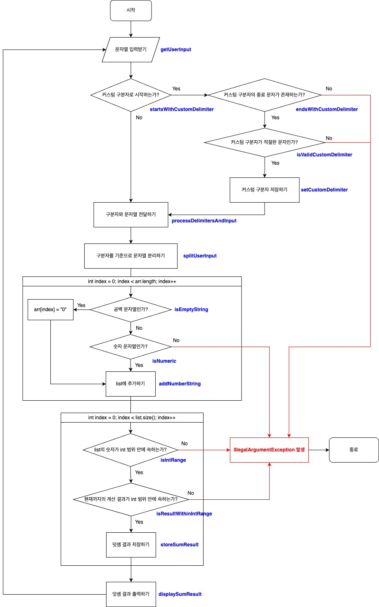

# java-calculator-precourse

## 기능 요구 사항
입력한 문자열에서 숫자를 추출하여 더하는 계산기 구현
- 구분자를 기준으로 분리한 각 숫자의 합을 반환한다.
- 기본 구분자 : 쉼표(,) 또는 콜론(:)
    - 예: "" => 0, "1,2" => 3, "1,2,3" => 6, "1,2:3" => 6
- 앞의 기본 구분자(쉼표, 콜론) 외에 커스텀 구분자를 지정할 수 있다.
- 커스텀 구분자 : 문자열 앞부분의 "//"와 "\n" 사이에 위치하는 문자
    - 예: "//;\n1;2;3" ⇒ 커스텀 구분자는 세미콜론(;)이며, 결과 값은 6이 반환
- 사용자가 잘못된 값을 입력할 경우 `IllegalArgumentException`을 발생시킨 후 애플리케이션은 종료되어야 한다.

### 에러 발생 상황
- 사용자가 잘못된 값을 입력한 경우
  - 커스텀 구분자를 설정하는 `//`로 시작했는데 `\n`가 존재하지 않을 경우
  - 구분자로 분리된 문자열에 숫자 외의 다른 문자가 존재하는 경우
- 커스텀 구분자가 적절한 문자가 아닌 경우
  - 커스텀 구분자가 공백일 경우
  - 커스텀 구분자가 숫자일 경우
  - 커스텀 구분자가 기본 구분자와 동일할 경우
- 숫자가 int 범위보다 큰 경우
  - 구분자로 분리된 문자열의 크기가 int 보다 큰 경우
  - 계산된 결과가 int 보다 큰 경우

### 종료 조건
- 사용자가 잘못된 값을 입력할 경우

## 입출력 요구 사항

### 입력
- 구분자와 양수로 구성된 문자열

### 출력
- 덧셈 결과
````
결과 : 6
````

### 실행 결과 예시
````
덧셈할 문자열을 입력해 주세요.
1,2:3
결과 : 6
````

## 기능 구현 목록

## 로직

## 순서도
